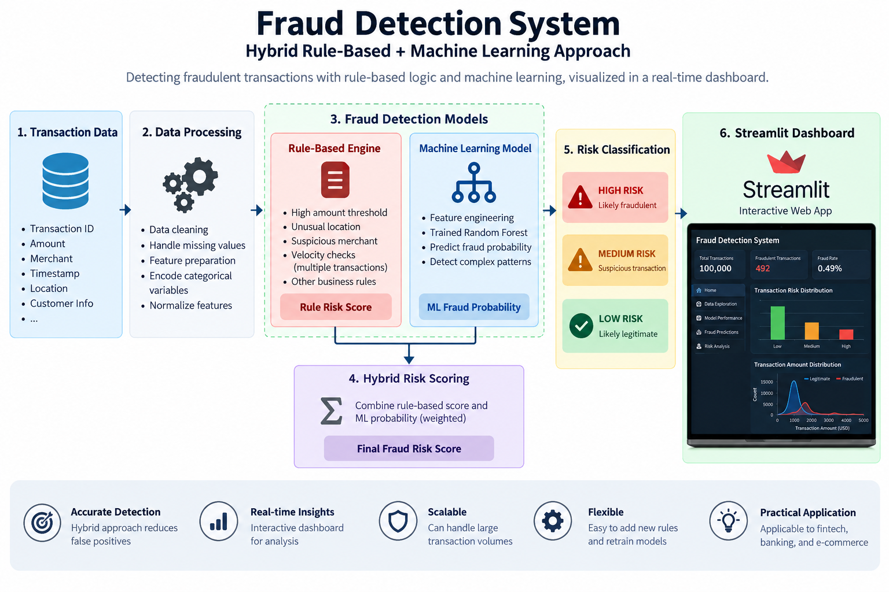
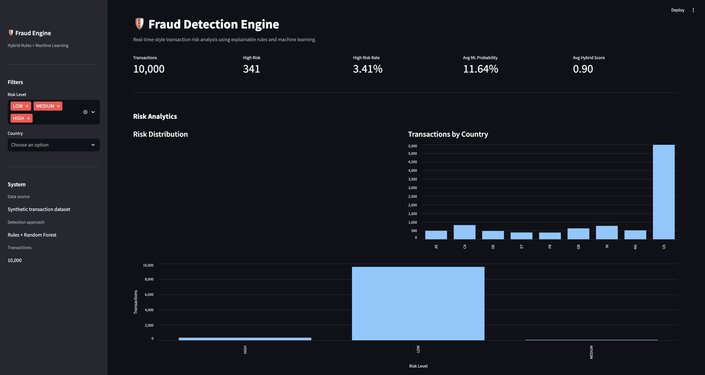
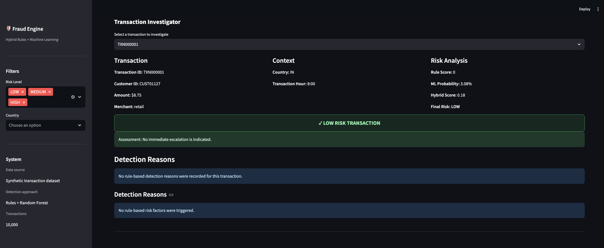
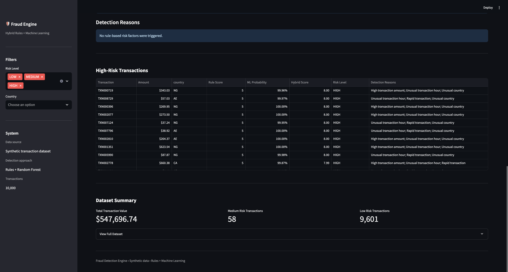

Fraud Detection System

A hybrid transaction fraud detection system that combines explainable rule-based detection with a Random Forest machine-learning model to produce an overall transaction risk assessment.

The project uses a synthetic transaction dataset and provides an interactive Streamlit dashboard for analyzing transaction risk, investigating individual transactions, and reviewing detection reasons.

⸻

Overview.

Financial transaction monitoring systems often combine deterministic rules with machine-learning models.

This project demonstrates that approach through a hybrid fraud detection pipeline:

Transaction Data
│
▼
Data Processing
│
▼
Rule-Based Detection ──────────────┐
│                           │
▼                           │
Feature Engineering                │
│                           │
▼                           │
Random Forest Model                │
│                           │
▼                           │
ML Fraud Probability               │
│                           │
└─────────────┬─────────────┘
▼
Hybrid Risk Score
│
▼
LOW / MEDIUM / HIGH
│
▼
Streamlit Dashboard

The goal is to combine the explainability of deterministic rules with the pattern-recognition capabilities of machine learning.

## System Architecture

## Dashboard

The project includes an interactive Streamlit dashboard for monitoring transaction risk, investigating individual transactions, and reviewing high-risk activity.

### Main Dashboard

### Risk Analytics

### Transaction Analysis

⸻
## Dashboard

The project includes an interactive Streamlit dashboard for monitoring transaction risk, investigating individual transactions, and reviewing high-risk activity.

### Main Dashboard

### Risk Analytics

### Transaction Analysis

* Synthetic transaction dataset generation
* Rule-based transaction monitoring
* Machine-learning fraud classification
* Transaction behavior feature engineering
* Hybrid risk scoring
* Explainable detection reasons
* Individual transaction investigation
* Risk-level filtering
* Country filtering
* Risk distribution analytics
* Transaction volume analysis by country
* High-risk transaction table
* Automated testing with Pytest
* Interactive Streamlit dashboard

⸻

Detection Approach

1. Rule-Based Detection

The rule engine evaluates transaction characteristics and assigns a rule-based risk score.

Example rules include:

* High transaction amount
* High transaction velocity
* Unusual transaction hour
* Rapid transactions
* Unusual country

Each triggered rule contributes to the transaction’s rule-based risk score.

The system also records the reasons behind each detection, allowing an analyst to understand why a transaction was flagged.

Example:

High transaction amount
Unusual transaction hour
Unusual country

⸻

2. Feature Engineering

Transaction-level behavioral features are prepared for the machine-learning model.

Examples include:

* Transaction amount
* Transaction hour
* Transactions within the previous 24 hours
* Time since previous transaction
* Country-related transaction behavior
* Rule-based risk information

These features allow the model to identify patterns associated with higher transaction risk.

⸻

3. Machine Learning

The project uses a Random Forest classifier to estimate the probability that a transaction represents fraudulent activity.

The model produces an ML fraud probability between 0 and 1.

The dashboard displays this probability as a percentage.

For example:

ML Fraud Probability: 99.46%

⸻
Model Evaluation

The Random Forest model was evaluated using the ROC-AUC metric.

Metric	Result
ROC-AUC	0.9051

A ROC-AUC score of 0.9051 indicates that the model demonstrated strong ability to distinguish between the classes in the generated synthetic dataset.

Note: Model performance is specific to the synthetic dataset and experimental setup used in this project. It should not be interpreted as representative of performance on real-world financial transaction data.
4. Hybrid Risk Scoring

The system combines the deterministic rule score with the machine-learning probability to produce a hybrid risk assessment.

Conceptually:

Rule Risk Score
+
ML Fraud Probability
│
▼
Hybrid Risk Score
│
▼
Final Risk Level
│
├── LOW
├── MEDIUM
└── HIGH

This provides two complementary perspectives:

Rules

* Explainable
* Deterministic
* Easy for analysts to interpret

Machine Learning

* Identifies patterns across transaction features
* Produces a probability-based risk signal
* Can capture combinations of features that may not be covered by individual rules

⸻

Dashboard

The project includes an interactive Streamlit dashboard called Fraud Detection Engine.

Risk Analytics

The dashboard provides:

* Total transaction count
* High-risk transaction count
* High-risk rate
* Average ML fraud probability
* Average hybrid risk score
* Risk distribution
* Transactions by country

Transaction Investigator

Users can select individual transactions and inspect:

* Transaction ID
* Customer ID
* Amount
* Merchant category
* Country
* Transaction hour
* Rule score
* ML probability
* Hybrid score
* Final risk level
* Detection reasons

High-Risk Transactions

The dashboard provides a table of high-risk transactions containing:

* Transaction ID
* Amount
* Country
* Rule score
* ML probability
* Hybrid score
* Risk level
* Detection reasons

⸻

Example Results

One generated dataset/run produced the following results:

Metric	Result
Total transactions	10,000
High-risk transactions	341
High-risk rate	3.41%
Medium-risk transactions	58
Low-risk transactions	9,601
Average ML fraud probability	11.64%
Average hybrid score	0.90
Total transaction amount	$547,696.74

Note: These figures describe one generated synthetic dataset/run and are not intended to represent real-world fraud rates.

⸻

Dataset

The project uses synthetic transaction data generated specifically for this project.

No private banking, payment, or customer information is used.

The generated transactions contain attributes such as:

* Transaction ID
* Customer ID
* Transaction amount
* Merchant category
* Country
* Transaction hour
* Transaction timing information
* Transaction frequency
* Risk-related features

Synthetic data makes the project reproducible while avoiding exposure of sensitive financial information.

⸻

Project Structure

Fraud-Detection-System/
│
├── app/
│   └── dashboard.py
│
├── data/
│   ├── raw/
│   └── processed/
│
├── models/
│   └── fraud_model.joblib
│
├── notebooks/
│
├── src/
│   ├── feature.py
│   ├── generate_data.py
│   ├── model.py
│   ├── rules.py
│   └── scoring.py
│
├── tests/
│   └── test_fraud_detection.py
│
├── .gitignore
├── README.md
└── requirements.txt

⸻

Technologies

Programming & Data

* Python
* Pandas
* NumPy

Machine Learning

* Scikit-learn
* Random Forest
* Feature engineering
* Classification

Data & Analytics

* Synthetic data generation
* Transaction analytics
* Behavioral feature engineering

Application

* Streamlit

Testing

* Pytest

Development

* Git
* GitHub
* PyCharm / IntelliJ IDEA

⸻

Installation

1. Clone the Repository

git clone https://github.com/SamiAndu/Fraud-Detection-System.git
cd Fraud-Detection-System

2. Create a Virtual Environment

python3 -m venv .venv

3. Activate the Virtual Environment

On macOS/Linux:

source .venv/bin/activate

4. Install Dependencies

pip install -r requirements.txt

⸻

Generate Transaction Data

Run:

python src/generate_data.py

This generates the synthetic transaction dataset used by the project.

⸻

Run Fraud Scoring

Run:

python src/scoring.py

The processed results are written to:

data/processed/final_risk_results.csv

⸻

Run the Dashboard

Start Streamlit:

streamlit run app/dashboard.py

The application will be available at:

http://localhost:8501

⸻

Run Tests

The project includes automated tests covering the fraud detection pipeline.

Run:

python -m pytest

Example successful test run:

6 passed

⸻

Explainability

A major design goal of this project is to make transaction risk understandable.

Instead of returning only:

HIGH

the system can provide explanations such as:

High transaction amount
Unusual transaction hour
Unusual country

This makes the output more useful for a transaction-monitoring analyst investigating potentially suspicious activity.

⸻

Future Improvements

Potential extensions include:

* Real-time transaction scoring API
* PostgreSQL or Snowflake integration
* Model performance monitoring
* Precision, recall, and ROC-AUC evaluation
* Model explainability with SHAP
* Customer behavioral profiles
* Graph-based transaction analysis
* Streaming transaction processing with Kafka
* AWS deployment
* REST API using FastAPI
* Role-based analyst access
* Alert management and case workflows

⸻

Disclaimer

This project is an educational and portfolio demonstration.

The transaction dataset is synthetic, and the system is not intended for production financial-crime detection or real-world transaction approval decisions.

The reported results are specific to the generated dataset and should not be interpreted as representative of actual fraud rates or financial institution performance.

⸻

Author

Samuel Yeneneh

Master’s Student in Artificial Intelligence
Kennesaw State University

Areas of Interest

* Artificial Intelligence
* Machine Learning
* Fraud Detection
* FinTech
* Data Engineering
* Payments
* Cloud Computing
* Compliance Technology

⸻

Project Repository

GitHub:
https://github.com/SamiAndu/Fraud-Detection-System